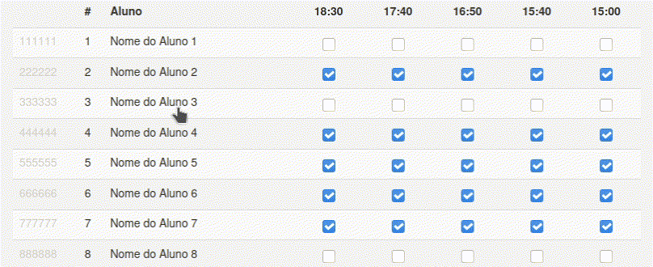

# SGA Helper

Um *bookmarket* que acrescenta a seguinte funcionalidade ao SGA:

Para adicionar ao seu navegador, basta arrastar o seguinte link para a sua barra de favoritos:

<a class="button" href="javascript:void%20function(){const%20a=document.querySelectorAll(%22%23class-record-presence-table%20tr%22);for(let%20b%20of%20a){const%20a=b.querySelectorAll(%22td%22);if(0===a.length)continue;let%20c=a[3],d=b.querySelectorAll(%22input[type=checkbox]%22);c.style.cursor=%22pointer%22,c.addEventListener(%22click%22,()=%3E{for(let%20a%20of%20d)a.checked=!a.checked})}}();">SGA Helper</a>
